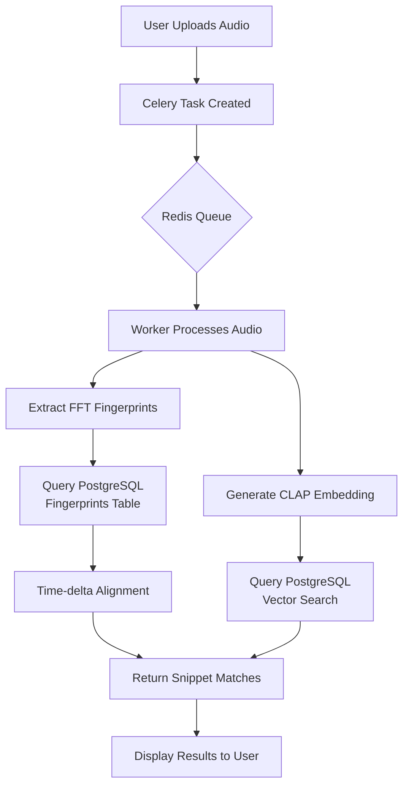

# SameSong

## What is it?

A software application meant to **identify songs** from **short audio snippets**, even in **noisy environments**.

## How does it look like?

[Screencast from 2026-02-10 16-45-05.webm](https://github.com/user-attachments/assets/d48ddac8-038c-4956-ac6b-eab5f6ef3945)


## How was it done?

This is done through using **two complementary approaches** to find matches. Each **song** is stored with **two fingerprints** - one for **exact matching** and one for **semantic similarity**.

Using this dual perspective, this software application employs several **algorithms** to obtain **accurate results**, such as:
  
  - **FFT Fingerprinting**: Extract spectral peaks and create hash-based fingerprints for exact matching (Shazam-style)
  - **CLAP Embeddings**: Use transformer-based audio understanding to find songs with similar "vibes"
  - **Time-delta Alignment**: Align matched hashes using offset patterns to pinpoint exact timestamps
  - **Vector Similarity Search**: Use pgvector's HNSW index for fast cosine similarity matching
  - **Async Processing**: Handle multiple uploads simultaneously using Celery task queue

## What technologies did I use?

For this project I decided to use **Python 3.11** for the backend processing and API.

For the **audio processing**, I used **librosa** for FFT analysis and **LAION CLAP** (transformer model) for semantic embeddings.

For the **persistence** part of this software, I've used a **PostgreSQL 16** instance with the **pgvector extension** for vector search, all containerized with **Docker**.

For the **task queue**, I used **Celery** with **Redis** as the message broker.

For the **web interface**, I used **Flask** with **Gunicorn** behind an **Nginx** reverse proxy.

After all this, I tied it all up using **Docker Compose**.

## Other capabilities

### 1. Bulk Music Ingestion

The system includes a scraper that can download and process music from Internet Archive in parallel:

```bash
python ingestion/scraper.py --limit 10 --workers 4
```

### 2. Automatic Database Loading

When starting the application with `docker-compose up`, the system automatically:
- Connects to PostgreSQL with retry logic
- Creates the database schema
- Loads pre-processed data from `data/database/database.dat`

No manual ingestion commands needed!

### 3. Dual Matching Results

The API returns both:
- **Snippet Matches**: Exact matches with timestamps
- **Vibe Matches**: Similar-sounding songs with confidence scores

### And more! 
Check out the code to discover the rate limiting, security measures, and Redis-based task tracking.

## Workflow



## Quick Start

### Start the application
```bash
docker-compose up
```

That's it! The database will auto-load and the app will be available at `http://localhost:80`.
